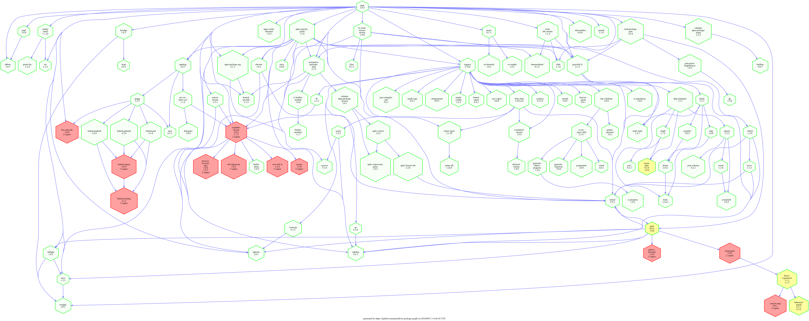

ns-package-graph - visualize packages used in an N|Solid runtime
================================================================================


`ns-package-graph` is a command-line tool to generate a graphical
representation of the packages being used in an N|Solid runtime.

usage
================================================================================

    ns-package-graph [options] [app or instance id]

When run with no arguments, displays some help and a list of running N|Solid
application names, and their instance ids.

When you pass an appplication name or instance id as parameter, a matching
instance will be sent the `nsolid-cli package_info` command, to capture
information on the process's packages and modules.  That information is used to
generate a [GraphViz][] [dot][] formatted graph diagram of package dependencies
in the running program.  That output is then passed to the awesome [Viz.js][]
library to convert into SVG, which is then written to stdout.

    $ ns-package-graph <nsolid app name or instance id>

    <?xml version="1.0" encoding="UTF-8" standalone="no"?>
    <!DOCTYPE svg PUBLIC "-//W3C//DTD SVG 1.1//EN"
     "http://www.w3.org/Graphics/SVG/1.1/DTD/svg11.dtd">
    <!-- Generated by graphviz version 2.38.0 (20140413.2041)
     -->
    ...

    $ ns-package-graph <nsolid app name or instance id> > packages-graph.svg

The package nodes in the graph output are annotated with color depending on
duplicate package status.  For duplicate copies of the exact same package name
and version, those nodes are colored red - they should have been de-duped.  For
duplicate copies of the exact same package name but different versions, those
nodes are colored yellow.

For example, here's the output from a run of npm version 3, in a few
different forms:

* [npm-3.dot](https://pmuellr.github.io/ns-package-graph/images/npm-3.dot.txt)
* [npm-3.svg](https://pmuellr.github.io/ns-package-graph/images/npm-3.svg)
* [npm-3.html](https://pmuellr.github.io/ns-package-graph/images/npm-3.html)
* [npm-3.png](https://pmuellr.github.io/ns-package-graph/images/npm-3.png)
  (generated with the GraphViz `dot` command line tool)



Clicking on the link to the SVG file above should open the graph in your
browser, allowing you to zoom in to see the node names / versions.  The HTML
file provides a nicer experience in a browser.

When displaying the SVG file in a browser, either directly, or indirectly via the generated HTML file, the following goodies are available:

* tooltips over nodes and edges
* each package node is a link to it's page at `npmjs.org` - just click the node to view

To generate the image in a format other than SVG, use the `--format dot`
option, and then use a [Graphviz][] tool to convert to the format of your
choice.  Eg:

    $ ns-package-graph --format dot MyApp > MyApp-packages.dot
    $ dot -T png -O MyApp-packages.dot   # generates MyApp-packages.dot.png

[GraphViz]: http://www.graphviz.org/
[dot]: http://www.graphviz.org/pdf/dotguide.pdf
[Viz.js]: http://mdaines.github.io/viz.js/


options
================================================================================

    -v --version      print the current version
    -h --help         print the help text
    -g --group        group by: "package", "version", "path"
    -f --format       output format: "svg", "dot", "html", "data-url"
    -c --child        child nodes: "dep", "parent"
    -s --server PORT  run server on specified port

defaults:

    --group    package
    --format   svg
    --child    dep
    --server   (no default port, must be passed as argument)

The `--group` option changes the grouping of the nodes to show:

* `package` - one node for each unique package, any version, any path loaded
* `version` - one node for each unique package / version, any path loaded
* `path` - node for each unique package / version / path loaded

The number of nodes drawn increases with each group option, respectively.

The `--format` option determines the output:

* `dot` - generate the Graphviz dot file
* `svg` - generate an SVG file from the Graphviz dot file data
* `html` - generate an HTML file with the embedded SVG and zoom controls
* `data-url` - generate a data URL for the SVG image

The `--child` option determines what children nodes are:

* `dep` - children are the dependencies of the package
* `parent` - children are packages that depend on the package

The `--server` option runs the program as an HTTP server.  You must pass a port
number to bind the HTTP server to.  The server responds to URIs of N|Solid
instance ids or application names, by generating a graph diagram of the packages
in the process.  The other options apply, so you'll probably want to use
the `--format html` option for a nicer experience.

A bookmarklet is available to create and view the graph diagram, when invoked
from the N|Solid Console pages. To create the bookmarklet, create a new bookmark
for this page, and then edit it to set the name to `ns-package-graph` (or
whatever you want), and set the URL to the text below. Customize the URL inside
the bookmarket URL (ie, `http://example.com:4000`) to be the root URL of your
ns-package-graph server. Then when you're on an N|Solid Console page which shows
a single app or process, you can click the bookmark and see the package diagram.

bookmarklet URL:

```
javascript:s='http://example.com:4000';h=location.href;m=h.match(/.*\/app\/.*\?processid=(.*)/)||h.match(/.*\/app\/.*\/process\/(.*)/)||h.match(/.*\/app\/(.*)/);if(m!=null)open(s+'/'+m[1],'_blank')
```


install
================================================================================

To install the `ns-package-graph` utility globally, run:

    npm install -g https://github.com/pmuellr/ns-package-graph.git

Note that you will to have N|Solid installed and running.  Specifically, this
utility will make calls into `nsolid-cli` to get information from the same
hub as your N|Solid runtime processes.

For more information on installing N|Solid, see:

* https://docs.nodesource.com/nsolid/1.4/docs/quickstart


additional samples
================================================================================

Two simple sample applications are included in the package:

* [sample_1](samples/sample_1) - app that uses `async` and `lodash`
* [sample_2](samples/sample_2) - app that uses `request` and `express`

Here are the outputs of running `ns-package-graph` on the running samples:

`sample_1`:

* [`sample_1.html`](https://pmuellr.github.io/ns-package-graph/samples/sample_1/sample_1.html)
* [`sample_1.svg`](https://pmuellr.github.io/ns-package-graph/samples/sample_1/sample_1.svg)
* [`sample_1.dot`](https://pmuellr.github.io/ns-package-graph/samples/sample_1/sample_1.dot.txt)
* [`sample_1.png`](https://pmuellr.github.io/ns-package-graph/samples/sample_1/sample_1.png)

`sample_2`:

* [`sample_2.html`](https://pmuellr.github.io/ns-package-graph/samples/sample_2/sample_2.html)
* [`sample_2.svg`](https://pmuellr.github.io/ns-package-graph/samples/sample_2/sample_2.svg)
* [`sample_2.dot`](https://pmuellr.github.io/ns-package-graph/samples/sample_2/sample_2.dot.txt)
* [`sample_2.png`](https://pmuellr.github.io/ns-package-graph/samples/sample_2/sample_2.png)

The `.png` files were created using the GraphViz `dot` command.

Note that `sample_2` used `npm` version 2 to `npm install` it's dependencies,
because that results in duplicated packages.  When using `npm` version 3,
there aren't any duplicated packages.


trouble shooting
================================================================================

The following sort of message will be displayed if the `nsolid-cli` command is
not installed.  Refer to the N|Solid installation instructions above.

    $ ns-package-graph

    error running `nsolid-cli info`: Command failed: nsolid-cli  info
    /bin/sh: nsolid-cli: command not found

For other `nsolid-cli` related errors, see the help information for that
command, by running:

    $ nsolid-cli --help

Eg, if you aren't running the N|Solid hub on the default ports, you can override
the defaults by creating a `~/.nsolid-clirc` file.


contributing
================================================================================

See the documents [CONTRIBUTING.md](CONTRIBUTING.md) and
[CODE_OF_CONDUCT.md](CODE_OF_CONDUCT.md).
