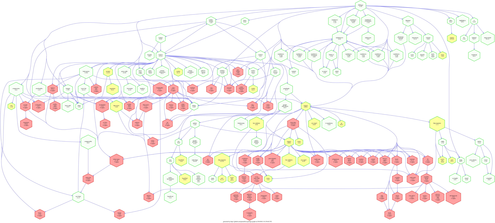

ns-package-graph - visualize packages used in an N|Solid runtime
================================================================================

usage
================================================================================

    ns-package-graph [app or instance id]

When run with no arguments, displays some help and a list of running N|Solid
applications, and their instances.

    $ ns-package-graph

    specify either an app name or id as an argument

    for more information, see: https://github.com/pmuellr/ns-package-graph

    apps:
       Dillinger
       nsolid-proxy
       nsolid-console

    ids:
       58ffb5ee98868127902a2fa7bcabb9e643ac2b26  (app: Dillinger)
       2a2fa7bcabb9e643ac2b2658ffb5ee9886812790  (app: nsolid-proxy)
       5eefaa53586d3f9a68aa54a39097d9bcd24d6ca5  (app: nsolid-console)

When you pass an app or instance id as parameter, a matching instance will
be sent the `nsolid-cli package_info` command, to capture information on the
process's packages and modules.  That information is used to generate a
[GraphViz][] [dot][] formatted graph diagram of package dependencies in the
running program.  That output is then passed to the awesome [Viz.js][] library
to convert into SVG, which is then written to stdout.

    $ ns-package-graph Dillinger

    <?xml version="1.0" encoding="UTF-8" standalone="no"?>
    <!DOCTYPE svg PUBLIC "-//W3C//DTD SVG 1.1//EN"
     "http://www.w3.org/Graphics/SVG/1.1/DTD/svg11.dtd">
    <!-- Generated by graphviz version 2.38.0 (20140413.2041)
     -->
    ...

    $ ns-package-graph Dillinger > ~/tmp/Dillinger.svg

The package nodes in the graph output are annotated with color depending on
duplicate package status.  For duplicate copies of the exact same package name
and version, those nodes are colored red - they should have been de-duped.  For
duplicate copies of the exact same package name but different versions, those
nodes are colored yellow.

For example, here's the output from an old version of [Dillinger][]:

[images/Dillinger.svg](images/Dillinger.svg)

Clicking on the link to the SVG file above should open the graph in your
browser, allowing you to zoom in to see the node names / versions.

[GraphViz]: http://www.graphviz.org/
[dot]: http://www.graphviz.org/pdf/dotguide.pdf
[Viz.js]: http://mdaines.github.io/viz.js/
[Dillinger]: http://dillinger.io/

install
================================================================================

To install the `ns-package-graph` utility globally, run:

    npm install -g https://github.com/pmuellr/ns-package-graph.git

Note that you will to have N|Solid installed and running.  Specifically, this
utility will make calls into `nsolid-cli` to get information from the same
hub as your N|Solid runtime processes.

For more information on installing N|Solid, see:

* https://docs.nodesource.com/nsolid/1.4/docs/quickstart

trouble shooting
================================================================================

The following sort of message will be displayed if the `nsolid-cli` command is
not installed.  Refer to the N|Solid installation instructions above.

    $ ns-package-graph

    error running `nsolid-cli info`: Command failed: nsolid-cli  info
    /bin/sh: nsolid-cli: command not found

For other `nsolid-cli` related errors, see the help information for that
command, by running:

    $ nsolid-cli --help

Eg, if you aren't running the N|Solid hub on the default ports, you can override
the defaults by creating a `~/.nsolid-clirc` file.

contributing
================================================================================

See the documents [CONTRIBUTING.md](CONTRIBUTING.md) and
[CODE_OF_CONDUCT.md](CODE_OF_CONDUCT.md).
